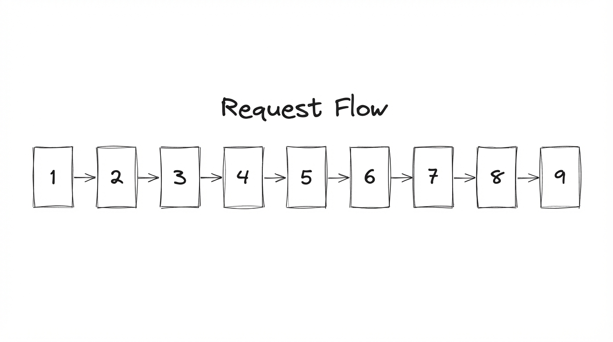
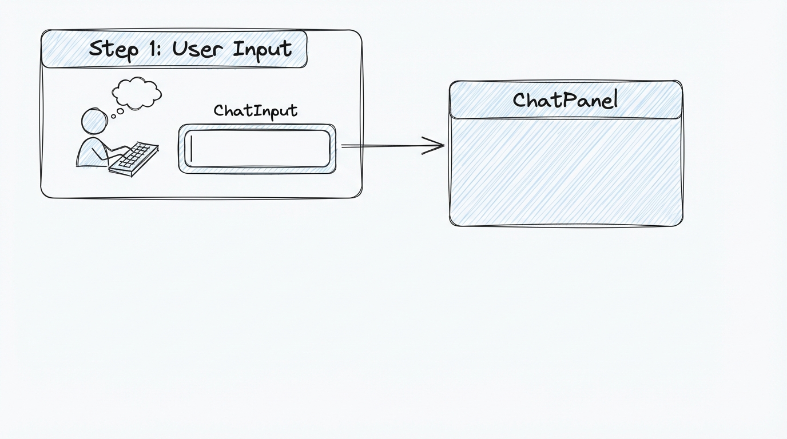
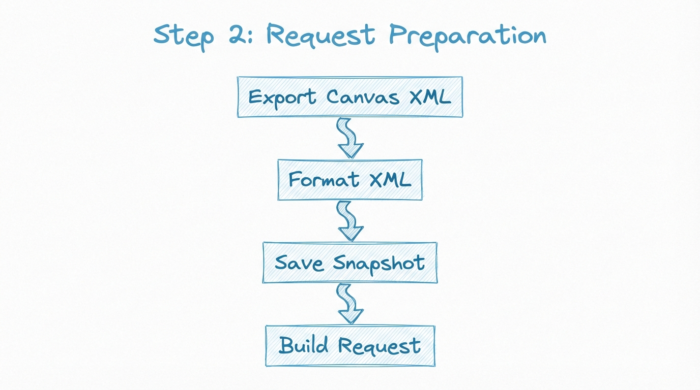
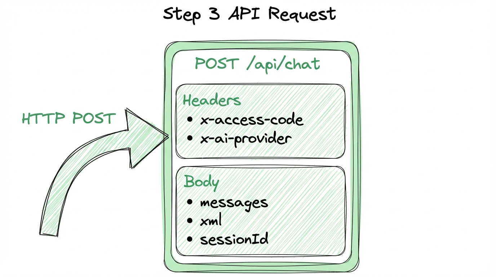
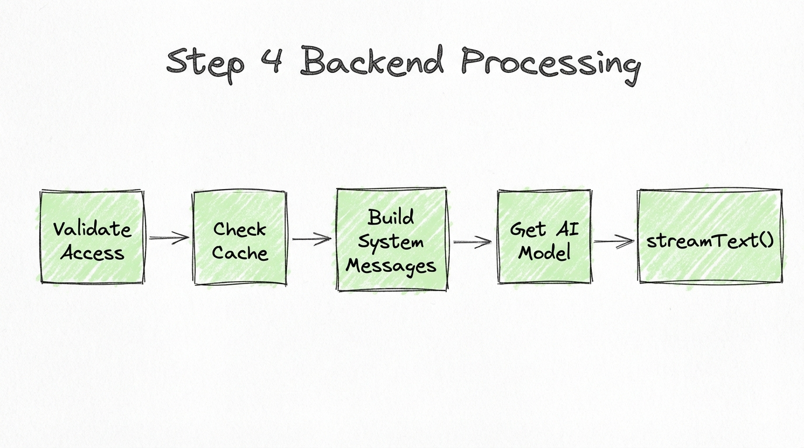
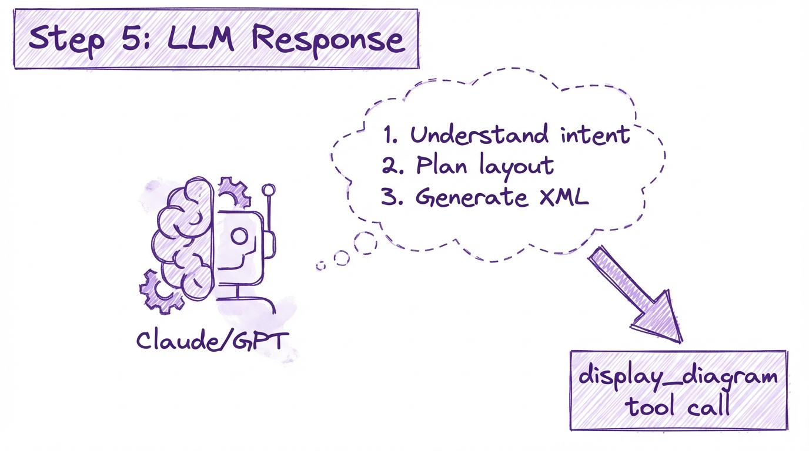
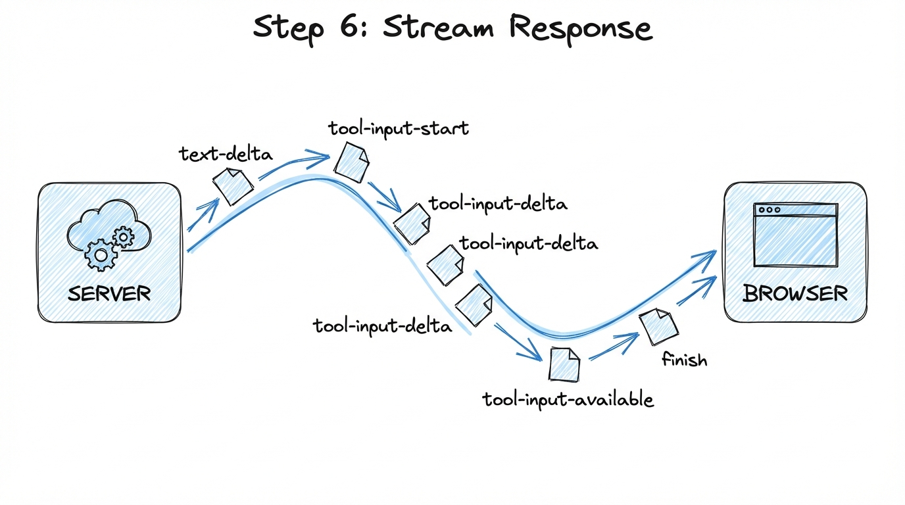
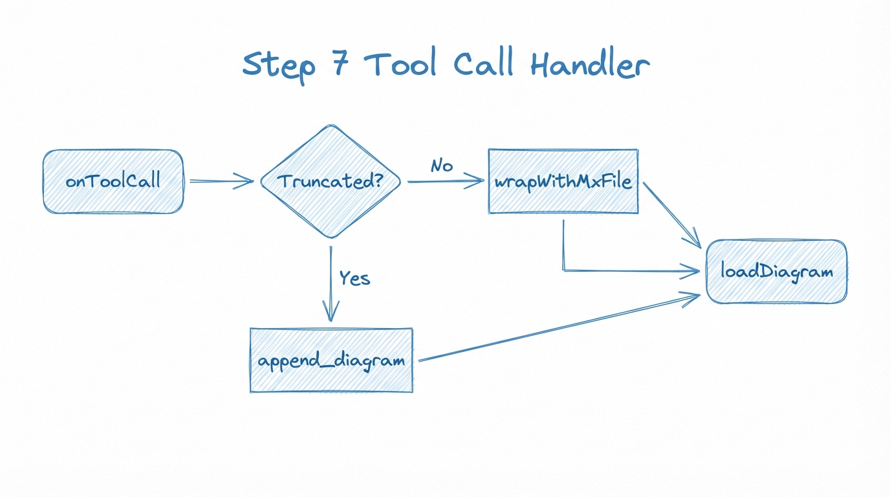
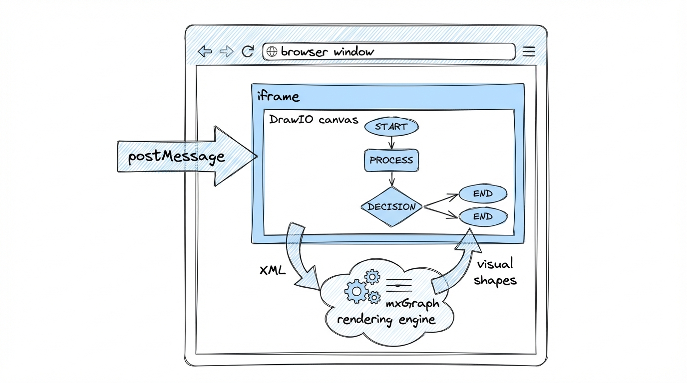

# Draw.io 请求处理全流程分析

> 本文档记录用户请求 "帮我绘制阿里云的OneData中,数据仓库分层理论最佳实践" 从前端到 draw.io 渲染的完整处理流程。

## 流程概览

```
User Input → ChatPanel → API Route → LLM → Tool Call → Validate → DrawIO Render
```



---

## Step 1: 用户输入 (Frontend Input)

### 组件位置
- `components/chat-input.tsx` - 输入组件
- `components/chat-panel.tsx` - 聊天面板

### 处理逻辑

```typescript
// chat-panel.tsx: onFormSubmit()
const onFormSubmit = async (e: React.FormEvent<HTMLFormElement>) => {
    e.preventDefault()
    
    // 1. 获取当前画布状态
    let chartXml = await onFetchChart()
    chartXml = formatXML(chartXml)
    
    // 2. 保存 XML 快照用于撤销
    xmlSnapshotsRef.current.set(messageIndex, chartXml)
    
    // 3. 发送消息到后端
    sendMessage(parts, { 
        body: { xml, previousXml, sessionId },
        headers: { "x-access-code": config.accessCode, ... }
    })
}
```

### 数据流

| 字段 | 说明 |
|------|------|
| `input` | 用户输入的文本 |
| `xml` | 当前画布 XML |
| `previousXml` | 上一次的 XML (用于 diff) |
| `sessionId` | 会话 ID (用于 Langfuse 追踪) |



---

## Step 2: 准备请求数据 (Request Preparation)

### 关键操作

1. **导出当前画布** - `drawioRef.current.exportDiagram()`
2. **格式化 XML** - `formatXML(chartXml)`
3. **保存快照** - `xmlSnapshotsRef.current.set()`
4. **构建请求体** - `{ parts, body: { xml, previousXml, sessionId } }`

### 代码片段

```typescript
// 获取当前画布 XML
const onFetchChart = (saveToHistory = true) => {
    return Promise.race([
        new Promise<string>((resolve) => {
            resolverRef.current = resolve
            onExport() // 触发 drawio 导出
        }),
        new Promise<string>((_, reject) =>
            setTimeout(() => reject(new Error("Timeout")), 10000)
        ),
    ])
}
```



---

## Step 3: API 请求 (Backend API)

### 端点
`POST /api/chat`

### 请求结构

```typescript
// Request Headers
{
    "x-access-code": "your-access-code",
    "x-ai-provider": "bedrock",      // 可选
    "x-ai-api-key": "...",           // 可选 (BYOK)
    "x-ai-model": "claude-sonnet-4"  // 可选
}

// Request Body
{
    "messages": [
        { "role": "user", "parts": [{ "type": "text", "text": "帮我绘制..." }] }
    ],
    "xml": "<current diagram XML>",
    "previousXml": "<previous diagram XML>",
    "sessionId": "session-xxx-xxx"
}
```

### 后端处理流程

```
app/api/chat/route.ts
├── 1. 验证 access code
├── 2. 检查缓存匹配
├── 3. 构建 system messages
├── 4. 获取 AI model 配置
├── 5. 调用 streamText()
└── 6. 返回流式响应
```



---

## Step 4: 后端处理 (Backend Processing)

### 文件位置
`app/api/chat/route.ts`

### System Messages 构建

```typescript
const systemMessages = [
    // Cache Breakpoint 1: 静态指令 (~1900 tokens)
    {
        role: "system",
        content: getSystemPrompt(modelId), // 来自 lib/system-prompts.ts
    },
    // Cache Breakpoint 2: 当前图表上下文
    {
        role: "system", 
        content: `Current diagram XML:\n"""xml\n${xml}\n"""\n\n...`,
    },
]
```

### Tools 定义

| Tool | 描述 | Input Schema |
|------|------|--------------|
| `display_diagram` | 创建新图表 | `{ xml: string }` |
| `edit_diagram` | 编辑现有图表 | `{ edits: [{search, replace}] }` |
| `append_diagram` | 续传截断的 XML | `{ xml: string }` |

### streamText 调用

```typescript
const result = streamText({
    model,
    maxOutputTokens: parseInt(process.env.MAX_OUTPUT_TOKENS, 10),
    stopWhen: stepCountIs(5),
    messages: allMessages,
    tools: {
        display_diagram: { ... },
        edit_diagram: { ... },
        append_diagram: { ... },
    },
})
```



---

## Step 5: LLM 生成响应 (LLM Response)

### 模型行为

1. **理解用户意图** - 分析 "阿里云 OneData 数据仓库分层"
2. **规划布局** - 2-3 句话描述布局计划
3. **调用 Tool** - 生成 display_diagram 调用

### 典型响应结构

```json
{
    "type": "text",
    "content": "我将创建一个从上到下的分层架构图，包含 ODS、DWD、DWS、ADS 四层..."
}
{
    "type": "tool_use",
    "name": "display_diagram",
    "input": {
        "xml": "<mxCell id=\"2\" value=\"ODS\".../>..."
    }
}
```

### System Prompt 关键规则

```
Core capabilities:
- Generate valid, well-formed XML strings for draw.io diagrams
- Create professional flowcharts, mind maps, entity diagrams

Layout constraints:
- Position all elements with x: 0-800, y: 0-600
- Maximum container width: 700 pixels
- Start positioning from margins (x=40, y=40)

CRITICAL:
- Generate ONLY mxCell elements - NO wrapper tags
- Do NOT include root cells (id="0" or id="1")
- All mxCell elements must be siblings - NEVER nest
```



---

## Step 6: 流式响应 (Stream Response)

### 响应类型

```typescript
// Stream chunks 类型
{ type: "text-delta", textDelta: "我将创建..." }
{ type: "tool-input-start", toolCallId: "xxx", toolName: "display_diagram" }
{ type: "tool-input-delta", toolCallId: "xxx", inputTextDelta: "<mxCell..." }
{ type: "tool-input-available", toolCallId: "xxx", input: { xml: "..." } }
{ type: "finish", usage: { inputTokens: 1234, outputTokens: 5678 } }
```

### 前端接收

```typescript
// @ai-sdk/react useChat hook
const { messages, sendMessage, addToolOutput, status } = useChat({
    transport: new DefaultChatTransport({ api: "/api/chat" }),
    onToolCall({ toolCall }) {
        // 处理 tool call
    },
    onFinish({ message }) {
        // 更新 token 计数
    },
})
```



---

## Step 7: Tool Call 处理 (Tool Call Handler)

### 文件位置
`components/chat-panel.tsx` - `onToolCall()`

### display_diagram 处理

```typescript
if (toolCall.toolName === "display_diagram") {
    const { xml } = toolCall.input as { xml: string }
    
    // 1. 检查是否截断
    const isTruncated = !isMxCellXmlComplete(xml)
    if (isTruncated) {
        partialXmlRef.current = xml
        addToolOutput({
            tool: "display_diagram",
            toolCallId: toolCall.toolCallId,
            state: "output-error",
            errorText: `Output was truncated. Use append_diagram to continue.`,
        })
        return
    }
    
    // 2. 包装 XML
    const fullXml = wrapWithMxFile(xml)
    
    // 3. 加载到 DrawIO
    const validationError = onDisplayChart(fullXml)
    
    // 4. 返回结果
    if (validationError) {
        addToolOutput({ state: "output-error", errorText: validationError })
    } else {
        addToolOutput({ output: "Successfully displayed the diagram." })
    }
}
```

### wrapWithMxFile 函数

```typescript
function wrapWithMxFile(xml: string): string {
    const ROOT_CELLS = '<mxCell id="0"/><mxCell id="1" parent="0"/>'
    
    // 移除已有的 root cells
    content = content
        .replace(/<mxCell[^>]*\bid=["']0["'][^>]*(?:\/>|><\/mxCell>)/g, "")
        .replace(/<mxCell[^>]*\bid=["']1["'][^>]*(?:\/>|><\/mxCell>)/g, "")
    
    return `<mxfile><diagram name="Page-1" id="page-1"><mxGraphModel><root>${ROOT_CELLS}${content}</root></mxGraphModel></diagram></mxfile>`
}
```



---

## Step 8: 加载到 DrawIO (Load to DrawIO)

### 文件位置
`contexts/diagram-context.tsx`

### loadDiagram 函数

```typescript
const loadDiagram = (chart: string, skipValidation?: boolean): string | null => {
    let xmlToLoad = chart
    
    // 1. 验证 XML 结构
    if (!skipValidation) {
        const validation = validateAndFixXml(chart)
        if (!validation.valid) {
            return validation.error
        }
        if (validation.fixed) {
            xmlToLoad = validation.fixed
        }
    }
    
    // 2. 更新状态
    setChartXML(xmlToLoad)
    
    // 3. 加载到 DrawIO iframe
    if (drawioRef.current) {
        drawioRef.current.load({ xml: xmlToLoad })
    }
    
    return null // 成功
}
```

### validateAndFixXml 检查项

| 检查项 | 说明 |
|--------|------|
| Duplicate IDs | 重复的 id 属性 |
| Unescaped chars | 未转义的 `<`, `>`, `&` |
| Nested mxCell | 嵌套的 mxCell 元素 |
| Empty IDs | 空的 id 属性 |
| Tag mismatches | 标签不匹配 |


---

## Step 9: DrawIO 渲染 (DrawIO Render)

### 组件
`react-drawio` - DrawIoEmbed

### 通信方式
通过 `postMessage` 与 iframe 通信

```typescript
// react-drawio 内部实现
drawioRef.current.load({ xml: xmlToLoad })
// → iframe.contentWindow.postMessage({ action: 'load', xml: xmlToLoad }, '*')
```

### mxFile 结构

```xml
<mxfile>
  <diagram name="Page-1" id="page-1">
    <mxGraphModel>
      <root>
        <mxCell id="0"/>                    <!-- Layer root -->
        <mxCell id="1" parent="0"/>         <!-- Default parent -->
        <mxCell id="2" value="..." .../>    <!-- User shapes -->
        <mxCell id="3" value="..." .../>
        ...
      </root>
    </mxGraphModel>
  </diagram>
</mxfile>
```

### 渲染过程

1. **接收 XML** - iframe 通过 postMessage 接收
2. **解析结构** - 解析 mxFile/diagram/mxGraphModel/root
3. **创建图形** - 使用 mxGraph 库渲染每个 mxCell
4. **显示结果** - 用户看到完成的图表



---

## 完整流程图

```
┌──────────────────────────────────────────────────────────────────────────┐
│                         COMPLETE REQUEST FLOW                              │
├──────────────────────────────────────────────────────────────────────────┤
│                                                                            │
│   User                Frontend              Backend              LLM       │
│    │                     │                    │                   │        │
│    │  "帮我绘制..."      │                    │                   │        │
│    │────────────────────>│                    │                   │        │
│    │                     │                    │                   │        │
│    │                     │ 1. Get current XML │                   │        │
│    │                     │    (exportDiagram) │                   │        │
│    │                     │                    │                   │        │
│    │                     │ 2. POST /api/chat  │                   │        │
│    │                     │───────────────────>│                   │        │
│    │                     │                    │                   │        │
│    │                     │                    │ 3. Build prompts  │        │
│    │                     │                    │    + tools        │        │
│    │                     │                    │──────────────────>│        │
│    │                     │                    │                   │        │
│    │                     │                    │ 4. Generate XML   │        │
│    │                     │                    │<──────────────────│        │
│    │                     │                    │                   │        │
│    │                     │ 5. Stream response │                   │        │
│    │                     │<───────────────────│                   │        │
│    │                     │                    │                   │        │
│    │                     │ 6. onToolCall      │                   │        │
│    │                     │    display_diagram │                   │        │
│    │                     │                    │                   │        │
│    │                     │ 7. wrapWithMxFile  │                   │        │
│    │                     │                    │                   │        │
│    │                     │ 8. validateAndFix  │                   │        │
│    │                     │                    │                   │        │
│    │                     │ 9. loadDiagram     │                   │        │
│    │                     │    (postMessage)   │                   │        │
│    │                     │                    │                   │        │
│    │  ┌─────────────────>│                    │                   │        │
│    │  │ Diagram Rendered │                    │                   │        │
│    │  └──────────────────│                    │                   │        │
│    │                     │                    │                   │        │
│    ▼                     ▼                    ▼                   ▼        │
│                                                                            │
└──────────────────────────────────────────────────────────────────────────┘
```

---

## 关键组件映射

| Step | 组件/文件 | 主要职责 |
|------|----------|----------|
| 1 | `chat-input.tsx` | 用户输入处理 |
| 2 | `chat-panel.tsx` | 请求准备、状态管理 |
| 3 | `app/api/chat/route.ts` | API 端点 |
| 4 | `lib/system-prompts.ts` | System prompt 定义 |
| 5 | LLM (Claude/GPT) | XML 生成 |
| 6 | `@ai-sdk/react` | 流式响应处理 |
| 7 | `chat-panel.tsx` | Tool call 处理 |
| 8 | `diagram-context.tsx` | DrawIO 通信 |
| 9 | `react-drawio` | 渲染 |

---

## 相关 Skill 脚本

完整流程中使用的核心函数已抽取为独立脚本：

| 脚本 | 对应函数 | 用途 |
|------|----------|------|
| `validate-xml.ts` | `validateMxCellStructure()` | Step 8 验证 |
| `fix-xml.ts` | `autoFixXml()` | Step 8 自动修复 |
| `wrap-xml.ts` | `wrapWithMxFile()` | Step 7 包装 |
| `edit-xml.ts` | `replaceXMLParts()` | edit_diagram 实现 |
| `append-xml.ts` | - | append_diagram 实现 |
| `format-xml.ts` | `formatXML()` | XML 格式化 |
| `check-complete.ts` | `isMxCellXmlComplete()` | 截断检测 |

---

*文档生成时间: 2025-12-14*
*基于 next-ai-draw-io 项目 commit: 68fdf8f*
